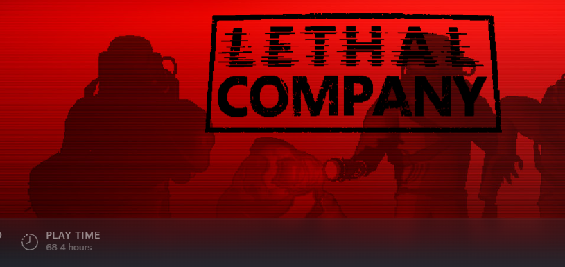

# Logbook
---
## Term 4, Week 7
We've officially been given our major work notifications! 
Though, I've known about it for a while now, and thus have had time to scheme away at what I wanted to do.
I had settled on two ideas: A VR Platformer, using grappling hook x Shotgun style weaponry (Think Attack On Titan)
and ASTA, the AstroPhysical Space-Time Atlas. I spent the week looking into game development platforms (UE v Un),
languages and other things. Little did I forget to factor in my own skill and time for this project...

I had achieved nothing more than a more solid idea of what I was going to do for the project that week, and thus
there was not much progress, nor issues, or extensive planning really. 

Overall, I should've factored in my own skill level and time available to work on the project, as this cost me dearly later on.

Some resources used (Not gonna link every page, but the home pages):
- https://dev.epicgames.com/documentation/en-us/unreal-engine/unreal-engine-5-1-documentation
- https://docs.unity.com/

## T4W8
That tuesday I had decided, I would pursue my passion of space and develop the most advanced collaborative atlas
of the known universe! I had dreams of grandeur -- seeing visions of a future where my skills would lead to a
mostly complete, fleshed out ASTA where, after the major work, I could continue to work on and then further
attempt to sell or contract out to a major space company -- securing both funds and a place in the industry, my passion.
As this was my option, I had to learn C++, Blueprinting and Developing with Unreal in whole... alas my laptop was
beginning to slip into the hands of death, and Unreal would only further accelerate it's timely demise... I had to
pause any direct usage of unreal until I built my desktop. Given the issue, I had continued my hobby and began
programming yet another strange, potentially useless piece of software. More on that later.

I had achieved far more this week than I did last week... at least anything is better than almost nothing, right?
I had begun looking more indepth at the Unreal Tutorials -- watching videos on how to do things like setup LODs
and Distance based Loading (crucial for ASTA as it would rather that then show every single catelogued star).

Overall, it was a good start, but I was hindered by the lack of available quality of technology, although, the parts
for my desktop were scheduled to arrive soon, a quite *powerful* desktop, one that would be able to run Unreal *flawlessly*.

Reviewal Note: This week was my most productive, Major work wise, as I had begun programming STELLA here.

## T4W9
It seemed that I'd forgotten that we had a design brief document due during the coming days, hm. 
DDs were _not_ my strong suit, as my continuous loss or tie to Adrian had well proven. No matter, I shall all-
nighter it as per standard protocal! Suprisingly, it didn't turn out badly -- only one mark lost (which Adrian had
_not_ lost) due to a silly oversight in my reading of the rubric (ordered means with structure, good to remember
that, me). I still was unable to work on my project due to the incapabilities of my laptop, but alas, such was life.
I spent most of the week solidifying my vision of ASTA, making sure that my boundaries were clear enough to prevent
me from suffering scope creep -- something I'm quite vulnerable to. And though, while I didn't end up all night'ing it
as I had originally thought my procrastinative self would've, my 22:23 submission the night before was premet with
a long call with Ronan and mates, something I truly treasure about the close-knit class we have, and thus the 
sadness from those, such as Joel, who've moved onto a better world... :c

Overall, I did really well with the documentation -- my best work, ignoring my blind oversight. Alas, my major 
roadblock was still in the way... but parts were arriving soon...

## T4W10
After chatting with sir, he told me about this wonderous system _WinDirStat_! I had cleaned up and optimized my home laptop to the point where I could use Unreal, perfect!
A breath of motivation filled me -- I could stop working on my other random projects and work on this, my dream!

A critical mistake.

Overall, I was tired from all the end of year exams, but excited to get into this new development environment and
language for the biggest project of my life to date. Other than waiting for UE5 and all the dependancies to install
and then configuring them, nothing much happened.

https://windirstat.net/

## Holidays, Week 1
School's over!
I can procrastinate!
I spent the first week of my holidays relaxing -- heading out to visit relatives too far for a day down during the term, and gaming with friends!
Sure, the major work work was piling up, but I was free of the stress of school -- a wonderful feeling.
Also... some more parts had arrived c:

Overall? I did nothing so there's nothing really anything to evaluate.

## HW2
The final part arrived -- my desktop was ready!
Ronan came over and we spent the afternoon building the hunk of metal -- and I was *estatic*! 
After building it I spent the rest of the week mostly downloading and playing game. It was *wonderful* being able to play 120+ FPS
on the highest quality settings without any frame drops with intense games, instead of just having to be potato mode.

https://au.pcpartpicker.com/list/PqJyWt

Overall? I did nothing so there's nothing really anything to evaluate, BUT since my desktop was now built, I could
steamroll my MW...

## HW3 - HW7
Compressing these weeks as they FLEW by.
I'd stopped keeping logs, the amazement at my new toy had completely pushed them
out of my mind. 
Most people were out of Sydney for these weeks, and with nothing scheduled I just
couch (or maybe chair) potato'd the whole time -- playing Cyberpunk, Lethal Company, Satisfactory and more,

as well as bruting my way through UE
Errors plagued my console...

and only with a Godly relevation would I recieve this, oh so rare, message

But hey, it was fun!
I learned a ton, I systematically **killed** errors as they appeared.
And yes, ChatGPT helped alot with learning C++ and how Unreal Engine worked, as some of the documentation was rather confusing...
All of the errors encountered were small, mostly due to me being extremely new to both the language and the scripting
that UE uses.

## HW8
This week was the week everyone would come back from their holidays!
And it's also the one week I'm away for -- my parents are truly organising our trips to ruin what
I have left of a social life...
Just kidding!
We went down to SA and had a wonderful time there -- I cage dived with great whites! 
If you're interested I can show you the videos! (Markdown doesnt allow video inserting sadly :c )
Of course, I couldn't bring my desktop to the beach house, nor was there any signal there (I know, I 
survived on 1 bar 3G for a week, maddening!), so I had no progress on my MW for this week.

# Term 1, Weeks 1-10!
I know, you wanted weekly updates, but I couldn't. I came into the term with a mind to balance both my major work,
social life, home life, study, and the fact that I was now morbidly infatuated with a certain individual, and it all just came crashing
into an unsightly mess. Luckily, nothing bad happened, but I had decided to set aside my Major work and focus on more pressing tasks, such as the Assessments
from week 6 onwards, and my personal mental health.

Example of an assessment I had done:

Example of the blueprints I was looking at:

]

# T1W11
This week was the pivotal moment.
I stepped back and re-evaluated my major work. It was at the point where, while I was learning immense amount of content
I was still too inexperienced, taking too long to do simple things, whereas the harder things probably would've taken weeks.
It had to change, either I had to, or it had to.
Fortunately, I had the perfect substitute!
That innocent, silly little .NET program I had been working on in my free time, wouldn't that suffice?

And so STELLA was officially born.
STELLA was completely different, done in C#, on the WPF .NET Framework, with the end goal of being a computer assistant.
It was time to start programming like a wild fire.

# Term 1 Holidays, Week 1
I was off to a great start!
I was exploring the deep possibilities of Platform Invokation -- Interop with low level Windows functions.
I became obessed with the idea of an 'interface-less program', one that would be so automated, that you didnt need to do much, or anything
for it to do alot. I had set up my undetectable, all seeing window that captured all keyboard input, and was able to block and send its own.

The power I felt... luckily I wasn't making a virus.

These websites helped a TON as there's no internal documentation to these (as most are linked / imported from external modules
at compile time)
- https://pinvoke.net/
- https://learn.microsoft.com/en-us/dotnet/standard/native-interop/pinvoke

# Term 1 Holidays, Week 2
Roadblocks had been hit in that I seemed to be way in over my head -- errors causing errors causing errors, things that would break between builds without them being directly affected
Was the motivation from last week just a drunken stupor on the excitement of possibly my favourite project?

No. I kept at it and I ended up deviating from the original design in two ways:
- I gave it an interface, but an overlay one. One that would only be around when you need it.
- I gave it logging powers

The interface was simple, but I liked it. Simple was good. I'm not a graphic designer and I dislike AI art, so I made it
as functional but still relatively pleasing to the eye as possible.

(The Interface over my desktop)

As for the logging powers, it was absoletely game changing. 
Sure, they were a bit clunky and took a while to read, but unsolvable errors became a thing of the past.
Now, I knew what was happening at any and every point from compilation to crash, when important things happened, what happened just before the crash
what exactly caused the crash and more! It was almost as if the program was telling me where to go and what to fix as needed, perfect!

Significant progress was made during this week, the most of any. I was now programming in my best language (C#), in an environment I was
most comfortable with (.NET App Development), with no looming exams (Holidays) and a good mental state.

In other words,

I cooked.

# Term 2, Week 1
My motivation continued to burn bright -- whenever I could I was programming one small bit after another, after another, after another.
Alas, my school work ethic crashed and burned, but no matter.
The week came and went with the full implementation of shortcut commands!
My dream of an interface-less software was realised!
Though very limited in functionalty, I was estatic at this milestone -- a true breakthrough!

# T2W2
Whoops.

I'd forgotten about the manuals that we needed to write, and it was a perfect time to get them done!
I'd left the drive that had my most recent version of STELLA on it at my grandmother's, and thus I couldn't work on it in software for the week...
Instead I wrote up my reference and installation manual!
I showed it to Sir, or well, I showed the installation manual, and he seemed impressed -- a good confidence booster!
I left my reference manual rather empty, as I was still to add more commands, and even voice commands were a plan!
But, assessments loomed everclose. 
And these ones counted.

# T2W3-W4
Nothing happened regarding software herer apart from more minor additions -- most of it was revision for the exams nigh-approaching.

# T2W5
I gave myself a small break over the weekend and got voice commands working!
And... oh my lord it's annoying. 

I, sadly, am not employed, and so using a commerical STT model was out of the question, and using a heavyweight, locally processed one
would result in too high a memory footprint, so I went with the classic *System.Speech* model..!

And it was driving me NUTS. It couldn't hear ANYTHING correctly!

But, I WANTED this to work, I NEEDED it.

So, what did I do?

I came up with a solution, of course.

I made a json file full of replacement words that sound like the targeted words, then wrote an algorithm to parse the raw audio into it

And hey! It worked!
STELLA could now hear what I had said correctly, maybe 60% of the time -- good enough!

# T2W6-W8
Nothing happened during these weeks. Physics, IPT, and other subjects had exams / assessments and as such, they took higher priority.
Getting close now...
But, I assured myself, I was fine. I had complex code, I had learned alot, and even if I didnt get as much end user functionality as I wanted
I still got alot, and some complex stuff too!

# Term 2... Week Nine. 
Judgement week.
I spent the whole week like a rabid dog, programming and documenting and programming and documenting and programming and documenting and...
you get the picture.
By Wednesday, I was curious, "How much have I written?"

It was not a question I should've been seeking an answer for.

Regardless, by 05:00 of the 27th, I was proud. 
Proud of the word I'd done, proud of what I'd taught myself, and proud of how I'd done it.
Overall, this was a really fun major work, and I hope to continue STELLA into the future.

---
---
---

# Evaluation
## Advantages of the Outcome
- It turned out to be much nicer, faster, and memory light than I had originally estimated -- than I expected with my capabilities.
- I've probably tripled my knowledge / skills in C# / .NET. I know so much more about almost all aspects of application development.
- It does as I planned it do, it works as a desktop assistant with customization and automation functionality -- my exact vision for it
- I'm extremely happy with the logging system. My main problem with alot of modern software is that logs are either useless, extremely complex, lack struture
or they just don't exist. So here, with STELLA, where I have structured, sensical, not too hard to understand logs, and they're extremely fast with generation and queuing, I'm really proud of that aspect, and in an actual implementation environment, I'm sure users and QA testers and other would appreciate it as well.

## Disadvantages
- My speech recognition is like an 80 year old, you have to speak slowish, clear and might have to repeat yourself once or thrice.
- I didn't get to complete as much functionality as I'd have liked. While it does do alot of complex things, I don't believe it does enough.
- How long it took to make some features -- due to the complex and low level nature of alot of the features, they took far longer than expected.
- There are still bugs, some that seem easy to fix but I cannot figure out how.
- There's no clearer, no wipe, no uninstall, which is crucial for both testing and implementation

## Major problems encounterd
- Scope Creep: I found it hard to stick to one aspect and ended up with a bunch of 'In development' features which I would've liked to have but didnt get around to
- Technological blockage: My laptop wasnt powerful enough to run UE5
- Skill issue: I lacked the foundational skill to teach myself how to use Unreal Engine 5 and C++ quick enough, leading to exponential delays
- Time: I severely misjudged the amount of time left, and how long aspects would take to complete
- Learning Curve: The learning curve for low level C# and .NET to the level of STELLA meant that many aspects took longer to grasp and then refine leading to delays
- Life balance: It was difficult to balance school, home, social and study life all together leading to the requirement of breaks and thus delays

## How were these issues fixed?
- Scope creep: I sat down and drew up a plan of attack on how I would approach the aspect implementation and stuck to it. Command done? Move to Command #2, not #3. Have an idea? Write it down, don't fanboy over how cool it would be.
- Technological blockage: I bought a far more powerful computer that could run virtually ANYTHING I required.
- Skill issue: Unsolved, even now I would still lack the skill needed to complete ASTA.
- Time: I micromanaged and created functions to speed up aspect development, such as Extended Logging and Attribute based optimization which improved development performance 10 fold.
- Learning Curve: I was able to surpass the curve for the functions needed, and from there didn't need to refer to tutorials and guides as I knew what I wanted, when, and where.
- Life balance: I developed a Trello board, stuck to my wall, where I was able to manage my weekly schedule.

## What have I learned
I have learned SO much.
- Interop / Platform Invokation
- Managed and unmanged code generation and production
- Structural layouts
- How computers actually assing binary when serializing and deserializing objects
- Consequently, Binary file handling
- Functional layer hooking
- Raw input creation, interception, manipulation and consuming
- Aspect Oriented Programming
- Function Oriented Programming
- Anonymous type programming
- Generic types
- Class extensions
- API management
- Speech to text handling
- Replacement therapy for large data
- shortcut creation
- Language interpolation and mixing (Pydiode, JSInterop, Native Interop)
- and so much more.

## Comparison
Due to the nature of my major work changing entirely, the evaluation critera set in AT1 is largely inapplicable. 

As I presume you'd prefer that this wasn't blank, so I'll include an adjusted one.

|     Feature     |     Included     |
|-----------------|------------------|
| Tutorials       | Yes, 95% (Most commands)         |
| Macro Functions | No |
| Voice Commands | Yes, 80% (Unstable) |
| Shortcuts | Yes |
| CLI | Yes | 
| Windowless App | Yes, 90% (Some windows included) | 
| Launches on Startup | No |
| Auto Key Clicker | No |
| Plotting | No | 
| Cursor effects | Yes, 70% (Uncustomizable) |
| On the spot define | Yes, 90% (Unstable) |
| On the spot search | No | 
| Interfaceless screenshotting | Yes | 
| Interfaceless Recording | No | 

## Gantts, Planned vs Actual
Planned:

Actual:

