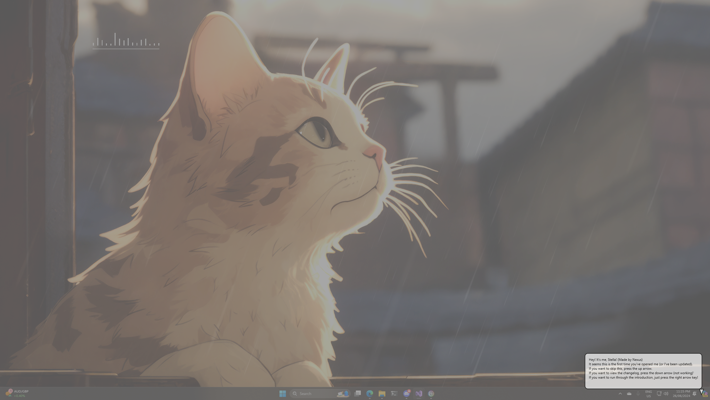
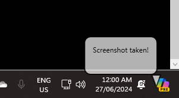
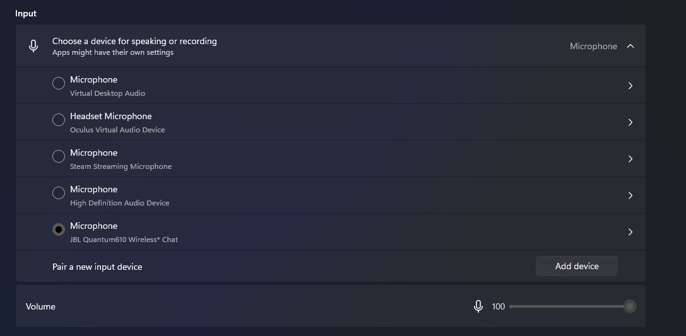
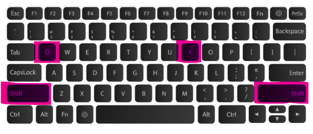
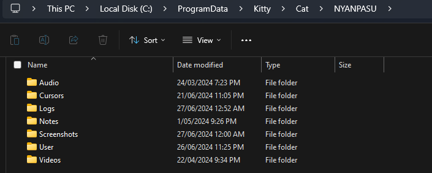
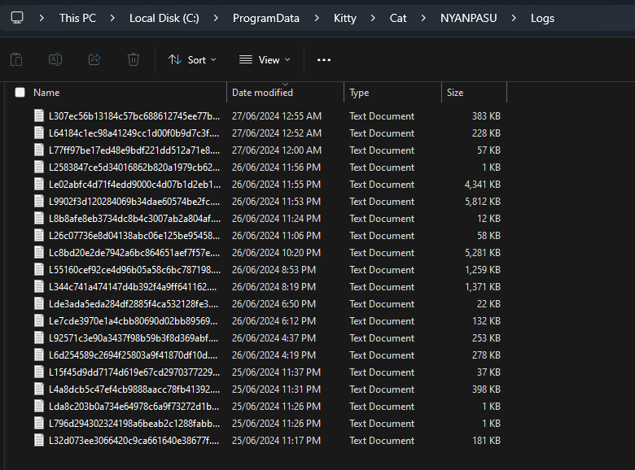

# Welcome to STELLA!
## Contents

## Intro
This is STELLA, the **S**mart **T**echnology for **E**nhanced **L**ifestyle and **L**iving **A**ssistance! 
Her sole purpose is to automate, optimize and otherwise improve your computer experience through the employment of a customised command line interface, voice (or spoken) commands and shortcuts. The latter of the two do not require any visuals of STELLA to be active, and can be used anywhere!
Without further ado, lets get into it!

## Starting Up
If you haven't already, you need to follow the [Installation Manual](https://github.com/trademark-claim/laughing-octo-garbanzo/blob/master/Installation.md) to download STELLA.

Once you have STELLA downloaded and extracted, locate the installation path and double click on the file called `cat.exe` (see below image).

If this is your first time running STELLA, or you've updated, you'll get a grey translucent overlay with a speech bubble in the bottom right corner -- This is Stella's Introductory sequence and will be a short, quick tutorial.

The overlay: 

Whenever these speech bubbles pop up, you can hit the left and right arrows to cycle through them, and press the up arrow to dismiss them entirely.

To test if the application opened correctly:
1. Press and hold down the `LShift` Key
1. Press and hold down the `RShift` Key
1. Press and hold down the `Q` Key
1. Press the `I` key
1. Release all keys

If an interface dropped down from above, then STELLA has successfully started up and is running!

---
The below sections explain core functions of STELLA divided by type.

---

## Set 1: Commands
### Voice Commands
#### Concept
Voice commands are one of the three ways you, the user, can interact with STELLA.

They're commands executed through the processing of the user's voice (audio input) and checking for the appearence of key words. If a match is found, a command is executed immedietely.

#### Proceedure
After activation through the ``toggle voice`` command or the `LSHIFT + RSHIFT + Q + V` shortcut, just speak into your primary audio input device and STELLA will listen and process your voice to activate commands!

For example, one of the patterns are the words "primary" and "screenshot", by saying any sentence with these words, such as "Hey Stella, can you take a screenshot of my primary screen?"

Afterwards, there'll either be a visible, on screen action (such as a window maximizing) or some output speech (see below image).

Now, depending on your settings, you may have to include the phrase "Hey Stella" before any command execution.

To toggle this, you can use the ``change setting ;RequireNameCallForVoiceCommands ;true`` to turn it on, or `change setting ;RequireNameCallForVoiceCommands ;false` to turn it off.

#### Known Issue
A known issue is that STELLA doesn't pick up any of your audio. This is likely due to the audio input device you're using is not your system's primary.
1. Open Settings
1. Go to Sound

1. Scroll down to Audio Input

1. Select the input device you're using and click the expand arrow (right side)

1. Set `Audio -> Allow apps and Windows to use this device for audio` to `Allow`

1. Set `Set as default sound device` to `Use as default for audio`

1. Voice commands should now work for you! If not, then you probably have an issue with your input device.

---

### Shortcut Commands
#### Concept
Shortcut commands are one of the three ways you can interact with STELLA. They are slightly more complex than Voice commands, and less complex than CLI commands.

Shortcuts are commands that are triggered by a combination of keys pressed in sequence. STELLA uses a functional hook that scans your key presses globally, so these can activate anywhere, anytime.

#### Proceedure
Unlike Voice Commands, these are always active, waiting for a trigger, and therefore require no user input to setup.

Firstly you need to know the combination for the shortcut you want to execute, such a list can be found [here](https://github.com/trademark-claim/laughing-octo-garbanzo/blob/master/ref_manual.md#shortcuts).
I'll use the ``Open Interface`` shortcut for demonstration purposes.

Secondly, you need to enter the right combination. For the ``Open Interface`` shortcut, the combination is ``LShift + RShift + Q + I``, where ``LShift`` is the `Shift` key on the Left side of the standard keyboard, and `RShift` is the `Shift` key on the right side of the standard keyboard.

So, I first press and hold the `LShift` key:

Then, I press and hold the `RShift` key:

Then, I press and hold the `Q` key:

Then, I press the `I` key, and release the rest:

After you complete the sequence, the shortcut will execute!

#### Issues
STELLA uses hooks, low level methods that interface with the functional layer of your computer. As such, there's a timer for these hooks that terminates them if they don't respond fast enough, causing the unresponsiveness. 
This will be especially true if you're putting your computer to sleep continuously.
You can try:
- Restart the program
- Restart computer
- Extend the hook timeout from registry (See [here](https://stackoverflow.com/questions/2655278/what-can-cause-windows-to-unhook-a-low-level-global-keyboard-hook) for a discussion on it)

---

### CLI Commands
#### Concept
CLI commands are one of the three ways you can interact with STELLA. The most conceptually complex of the three.

CLI Commands are run through the custom interface of STELLA, and are the most flexible of the lot. These commands are wholly entered by you.

#### Proceedure
Firslty, ensure you have the interface open (If not, run the shortcut ``LShift + RShift + Q + I``).

Then, you'll need to type out your command in the input field (see below)

The commands have two major parts: The call and the Parameters. Lets take the `help` command, for example.
The `help` command has one optional parameter, a string. This parameter defines what the command displays.

So, the 'call' of the command is the command name (or an alias), in this case it would be `help`. 
The Parameters of the command are what you tell the command to work with / on, in this case it could be `commands` or `add cursor to preset`, or any other command

Lets try executing `help` by itself, we get:

If we then execute ``help ;commands``, we get:

And there, those are CLI Commands!

#### Issues
If you see red text appearing, that means that something caused the command to prematurely execute. Usually it'll tell you why, and more information will be in the logs.

---

## Set 2: Backend Logic
### Local Data
#### Concept
STELLA involves alot of customization, and inherently has things like settings and other, leading to the subject of *Local Data*.

Local Data, being what the program stores on a disk to store between sessions, is crucial to the maximum functionality of STELLA, and thus has been implemented to a smooth degree.

#### Proceedure
STELLA herself will automatically update and read the local data it needs as the program runs, and this data can be found at `C:/ProgramData/Kitty/Cat/`, where you'll find two sub directories:

Inside `Downloads` will be where all the downloading that STELLA does will be stored, meanwhile all the user data will be stored inside `NYANPASU`:

The folders are:
- `Audio`: For the storing of audio recordings and general audio files
- `Cursors`: For the storing of cursor presets
- `Logs`: For the storing of the log files
- `Notes`: For the storing of macros and self notes 
- `Screenshots`: For the storing of screenshots taken
- `User`: For the storage of the userdata file
- `Video`: For the storage of Videos

#### Issues
There shouldn't be any issues with this, as the entire structure is managed by STELLA, and checks are in place for things like missing files.

---

### Logs
#### Concept
Logging is extremely vital to the execution of a good program, providing the user the tools to be able to solve problems themselves, but also to provide the developer with crucial details for the context around the bug. To this, STELLA generates a log file per session, with a myriad of optional logging levels, all in extreme detail and optimization.

#### Proceedure
The logging itself is completely managed by STELLA, and files will be flushed at set intervals or with the execution of the `flush logs` command.

These logs can be viewed at `C:\ProgramData\Kitty\Cat\NYANPASU\Logs`:

All with their own Globally Unique Identifier (for ease of access, sort them by ``Date``.)

These log files can be accessed, edited, changed, exported and otherwise manipulated freely, though messing with their structure or formatting may have adverse effects on the in build Log Viewer.

To change the amount of detail STELLA logs, please see the below section and [here](https://github.com/trademark-claim/laughing-octo-garbanzo/blob/master/ref_manual.md#change-settings) to change the logging related user settings.

#### Issues
If you're running STELLA on a far lower end device, you're concerned about storage, or the shutdown sequence takes far longer than expected, please disable some Logging options such as ``ExtendedLogging``, which add loading, processing and storage to the logging process.

---

### Settings
#### Concept
Customization is one of STELLA's prime directives, and thus having the option for users to customise their experience is paramount. This is what 'Settings' refers to, the changing of initial configuration to tailor STELLA to you.

#### Proceedure
Firstly, ensure you have the interface open (If not, run the shortcut ``LShift + RShift + Q + I``).

Then, you'll need to type out your command in the input field (see below)

From here, you'll be using the `change setting` command, with parameters `setting__name` and `new_value`. i.e. `change setting ;fontsize ;20`, which would set the fontsize to 20.

You can use the `view settings` command to see the current settings:

You can also use the `open settings` command to open a command menu and edit the values there directly, remember to hit save!